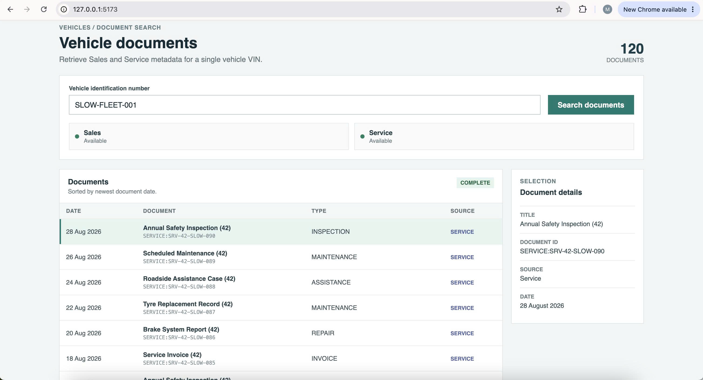
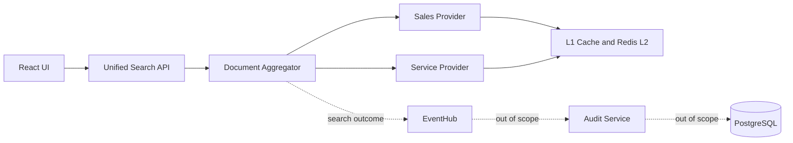
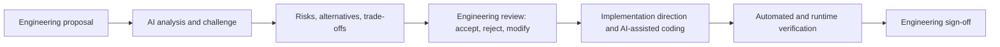

# Keyloop Unified Document Viewer

## Overview

This is Scenario D: a Unified Document Viewer. It accepts a VIN search, requests Sales and Service documents concurrently, normalizes their different contracts into one canonical model, and returns a consolidated view. Every document retains its source, and a failed provider yields a useful `PARTIAL` response when the other succeeds.



## Architecture at a Glance



Sales and Service remain the systems of record. The Unified Search Service has no direct persistent-database dependency. It publishes search-outcome events to EventHub. In the broader solution, the downstream Audit Service consumes those events and persists audit data to PostgreSQL; the Audit Service and PostgreSQL implementation are outside this repository. The local implementation uses a deterministic mock EventHub publisher and does not require cloud credentials. See [docs/system-design.md](docs/system-design.md) for detailed architecture, trade-offs, capacity assumptions, resilience, caching, Kubernetes, observability, and validation strategy.

## Technology Stack

| Area | Implementation |
| --- | --- |
| API | ASP.NET Core 10 / C# |
| Web UI | React, TypeScript, Vite |
| Cache | bounded in-memory L1 and Redis L2 |
| Telemetry | OpenTelemetry, Prometheus, Grafana, Tempo |
| Logs | Serilog, Elasticsearch, Kibana |
| Deployment | Docker Compose and Kubernetes manifests |
| Tests | xUnit and FluentAssertions |

## Prerequisites

- .NET 10 SDK
- Node.js 20+ and npm
- Docker Desktop with Docker Compose (macOS or Windows), or Docker Engine with the Compose plugin (Linux), for Redis and local observability

The setup commands below work in a Linux/macOS Bash or Zsh shell and in Windows PowerShell unless a platform-specific alternative is shown. Run the mock providers, API, and Vite client in separate terminal windows.

## Quick Start

From the repository root:

1. Start Redis:

   ```sh
   docker compose up -d redis
   ```

2. Build the solution:

   ```sh
   dotnet build Keyloop.UnifiedDocuments.slnx
   ```

3. In separate terminals, start the mock providers and API:

   ```sh
   dotnet run --project mocks/Keyloop.MockSalesApi --urls http://localhost:5101
   ```

   ```sh
   dotnet run --project mocks/Keyloop.MockServiceApi --urls http://localhost:5102
   ```

   ```sh
   dotnet run --project src/backend/Keyloop.UnifiedDocuments.Api --urls http://localhost:5100
   ```

4. Start the browser client:

   ```sh
   cd src/frontend/keyloop-unified-documents-web
   npm install
   npm run dev
   ```

   Open `http://127.0.0.1:5173`.

5. Obtain a development token and run a search.

   Linux/macOS shell:

   ```sh
   TOKEN=$(curl --silent http://localhost:5100/api/v1/auth/demo-token | node -e 'let body=""; process.stdin.on("data", chunk => body += chunk).on("end", () => console.log(JSON.parse(body).accessToken))')
   curl --silent \
     -H "Authorization: Bearer $TOKEN" \
     -H "X-Dealership-Id: 42" \
     http://localhost:5100/api/v1/vehicles/COMMERCIAL-001/documents
   ```

    Windows PowerShell:

    ```powershell
    $token = (Invoke-RestMethod http://localhost:5100/api/v1/auth/demo-token).accessToken
    Invoke-RestMethod http://localhost:5100/api/v1/vehicles/COMMERCIAL-001/documents `
       -Headers @{ Authorization = "Bearer $token"; "X-Dealership-Id" = "42" }
    ```

`/api/v1/auth/demo-token` and the fixed signing key exist only in the Development environment. Non-Development deployments must configure `Jwt__SigningKey` through a secret manager or deployment secret. Production authentication comes from the configured identity provider. `X-Dealership-Id` is an assessment boundary; production deployments would derive the dealership from trusted claims.

## API Examples

### REST

Linux/macOS shell:

```sh
curl --silent \
  -H "Authorization: Bearer $TOKEN" \
  -H "X-Dealership-Id: 42" \
  http://localhost:5100/api/v1/vehicles/COMMERCIAL-001/documents
```

Windows PowerShell:

```powershell
Invoke-RestMethod http://localhost:5100/api/v1/vehicles/COMMERCIAL-001/documents `
   -Headers @{ Authorization = "Bearer $token"; "X-Dealership-Id" = "42" }
```

### SSE

Linux/macOS shell (`-N` keeps curl from buffering source events):

```sh
curl -N \
  -H "Authorization: Bearer $TOKEN" \
  -H "X-Dealership-Id: 42" \
  http://localhost:5100/api/v1/vehicles/SSE-DEMO-001/documents/stream
```

Windows PowerShell:

```powershell
curl.exe -N `
   -H "Authorization: Bearer $token" `
   -H "X-Dealership-Id: 42" `
   http://localhost:5100/api/v1/vehicles/SSE-DEMO-001/documents/stream
```

## Demo Scenarios

| VIN | Scenario | Expected result |
| --- | --- | --- |
| `COMMERCIAL-001` | normal | `COMPLETE`: 30 Sales and 90 Service documents |
| `FLEET-042` | smaller normal result | `COMPLETE`: 14 Sales and 37 Service documents |
| `EMPTY-VEHICLE` | successful empty sources | `COMPLETE` with zero documents |
| `SLOW-FLEET-001` | slow sources | Sales delays 2s, Service delays 4s |
| `SSE-DEMO-001` | progressive stream | Sales completes first; Service is delayed |
| `SALES-DOWN` / `SERVICE-DOWN` | one unavailable provider | `PARTIAL` when the other source succeeds |
| `SALES-RATE-LIMITED` / `SERVICE-RATE-LIMITED` | upstream `429` | `PARTIAL` when the other source succeeds |
| `SALES-AUTH-FAIL` / `SERVICE-AUTH-FAIL` | upstream authentication failure | `PARTIAL` when the other source succeeds |
| `SALES-TIMEOUT` / `SERVICE-TIMEOUT` | slow timeout | `PARTIAL` when the other source succeeds |

Unknown VINs produce upstream `404` behavior and are represented through the unified response contract.

## Testing

### Run All Tests

```sh
dotnet test Keyloop.UnifiedDocuments.slnx --configuration Release
```

Latest verified result: **47 passed**: 34 unit tests and 13 integration/API tests.

### Unit Tests

```sh
dotnet test tests/Keyloop.UnifiedDocuments.UnitTests/Keyloop.UnifiedDocuments.UnitTests.csproj --configuration Release
```

The focused automated tests cover canonical document normalization, source identity, deterministic ordering, `COMPLETE` / `PARTIAL` / `FAILED` aggregation semantics, empty success, concurrent Sales/Service invocation, cancellation propagation, cache/lock behavior, and non-critical audit failures. Cache/lock coverage validates the local coordination logic; the API suite does not claim to prove a real cross-process Redis lock.

### Integration / API Tests

```sh
dotnet test tests/Keyloop.UnifiedDocuments.IntegrationTests/Keyloop.UnifiedDocuments.IntegrationTests.csproj --configuration Release
```

The 13 API integration tests exercise the actual ASP.NET Core HTTP/SSE pipeline with test-specific application-boundary fakes: JWT authorization, REST response and validation contracts, dealership propagation, and progressive/partial SSE events. They do not require Docker, real Redis, production credentials, or cloud services; cache/lock behavior is covered separately by focused automated tests.

## Observability

Start the local observability stack when needed:

```sh
docker compose -f deploy/observability/docker-compose.observability.yml up -d
```

- Kibana: `http://localhost:5601` for structured logs, provider failures, and trace correlation.
- Grafana: `http://localhost:3000` (`admin` / `admin`) for request rate, latency, cache, partial-result, provider, and SSE metrics.
- Tempo: `http://localhost:3200`; inspect traces in Grafana Explore using the Tempo datasource to see overlapping Sales and Service spans.
- Prometheus: `http://localhost:9090`.

## Key Implementation Notes

- **Dealership isolation:** cache and distributed-lock keys include source, dealership, and normalized VIN. A positive `X-Dealership-Id` is required for REST and SSE.
- **Cache and resilience:** providers use a per-pod bounded L1 cache, shared Redis L2, local request coalescing, and source-specific Redis locks. Redis is an optimization; failures fall back to providers.
- **Provider protection:** Sales and Service use independent concurrency limits, bounded queues, total provider budgets, retries, and `PARTIAL` semantics.
- **Audit boundary:** successful searches publish a small outcome event to a deterministic mock EventHub publisher. Audit persistence, reporting, and consumption are outside this service.
- **SSE:** source outcomes are flushed as they complete. Streams are short-lived and do not implement heartbeat or resume support.

Defaults are configurable in [appsettings.json](src/backend/Keyloop.UnifiedDocuments.Api/appsettings.json); detailed rationale is in [docs/system-design.md](docs/system-design.md).

## AI Collaboration Narrative

Engineering owned the problem framing, workload assumptions, architecture proposals, trade-off decisions, acceptance criteria, scope control, code review, verification, and final sign-off. AI was used as a design challenger, failure-mode reviewer, implementation and test-generation assistant, and documentation refactoring aid.



Examples from this assessment:

- **Caching:** AI was used to challenge memory safety, freshness, Redis failure, and multi-pod behavior. Engineering chose bounded per-pod L1 plus shared Redis L2.
- **Multi-pod misses:** review identified cache stampedes. Engineering chose provider-scoped Redis locks with a mandatory Redis recheck after acquisition.
- **Pagination:** the expected document volume is about 120 records, so engineering retained provider pagination but deliberately omitted unified API pagination.
- **Tenant boundary:** engineering chose `DealershipId` as the assessment authorization boundary instead of adding an unjustified user-permission model.
- **Progressive delivery:** REST-only, SSE, and WebSocket alternatives were reviewed. Engineering chose REST for snapshots and SSE for one-way progressive source outcomes.
- **Resilience:** AI review challenged retry amplification and provider overload. Engineering chose bounded overall/provider budgets with separate provider concurrency protection.

AI-generated work was not considered complete until it was reviewed, refined, and verified. Verification included core business-logic tests, API/SSE tests, cache and distributed-lock tests, dealership isolation checks, provider concurrency and failure behavior, Release builds, and local Kibana/Grafana/Tempo inspection. AI accelerated review and implementation, but architecture decisions, acceptance criteria, verification, and final sign-off remained engineering responsibilities.

## Assessment Assumptions and Known Limitations

- `X-Dealership-Id` is a demo/assessment mechanism; production would use trusted identity claims.
- Provider behavior is deterministic and mock document binaries/previews are outside Scenario D.
- Sales and Service remain systems of record; audit consumption and storage are outside this repository.
- The EventHub publisher is mocked locally and does not require cloud credentials.
- Local observability runs through Docker Compose; production settings require tuning against real provider contracts and traffic.
- The integration/API suite intentionally avoids Docker-dependent Redis fixtures. It verifies HTTP wiring; focused unit tests cover cache/lock and non-critical audit behavior.

## Further Design Documentation

[docs/system-design.md](docs/system-design.md) documents the assumptions, capacity estimation, architecture, trade-offs, caching and resilience design, Kubernetes topology, observability strategy, and validation approach.
