# Keyloop Scenario D — Unified Document Viewer

> **Purpose:** Provide a clear, production-oriented design for a VIN-based document search that aggregates Sales and Service documents while remaining responsive when one dealership system is slow or unavailable.
>
> **Design principle:** keep the aggregation path simple, isolate external-system differences behind adapters, and add complexity only where it protects user experience, upstream systems, or tenant boundaries.

---

## 1. Executive Summary

### At a glance

| Item | Decision |
|---|---|
| **User goal** | Search one VIN and see one consolidated Sales + Service document list |
| **Backend** | ASP.NET Core 10 / C# |
| **Frontend** | React + TypeScript |
| **Aggregation** | Sales and Service called **in parallel** |
| **Interactive delivery** | **SSE for progressive results**, with REST retained as the snapshot API |
| **Failure model** | `COMPLETE`, `PARTIAL`, or `FAILED` |
| **Caching** | Size-bounded L1 memory cache per pod + shared Redis L2 |
| **Cross-pod protection** | Redis distributed lock + double-check-after-lock |
| **Tenant boundary** | Positive integer `DealershipId` included in cache/lock identity |
| **Runtime** | Kubernetes, baseline 3 pods, HPA 3–10 |
| **Observability** | Kibana logs, Grafana metrics, Tempo traces |

A user searches by VIN and expects one consolidated list of documents. The backend queries the **Sales System** and **Service System in parallel**, normalizes their different contracts, and returns a single result where every document clearly identifies its source.

The difficult part is **not processing ~120 metadata records**. The difficult part is providing a predictable user experience while depending on two independently slow or failing dealership systems, then doing so safely across multiple application replicas.

The design therefore optimizes for five outcomes:

1. **Fast useful feedback** — parallel calls minimize total latency, while SSE can show the first completed provider before the slower provider finishes.
2. **Graceful degradation** — one provider may fail while the other still produces a useful `PARTIAL` result.
3. **Protection of external systems** — bounded L1 + shared Redis + request coalescing + distributed locking reduce repeated provider calls.
4. **Tenant safety** — `DealershipId` is part of cache and lock keys, preventing cross-dealership reuse.
5. **Proof through observability** — logs, metrics, and traces demonstrate latency, partial failures, cache effectiveness, and true parallel execution.

### Design objectives

> **The design deliberately adds complexity only where it buys measurable value:** lower perceived latency, graceful failure, reduced upstream load, safe multi-tenant caching, and operational visibility.

| Concern | Design response | Why it matters |
|---|---|---|
| Slow Service system | Parallel requests + SSE | Users see useful data sooner instead of waiting for the slowest dependency |
| One provider unavailable | `PARTIAL` result | A dependency outage does not turn into a total product outage |
| Repeated VIN searches | L1 + Redis cache | Lower latency and fewer external API calls |
| Same cache miss on several pods | Distributed lock | Prevents a cache stampede against legacy systems |
| Multiple dealerships | Dealership-aware keys | Prevents cross-tenant data leakage |
| Production diagnosis | Kibana + Grafana + Tempo | Architectural claims are measurable, not theoretical |

### Document structure

The document follows a standard system-design sequence: **define scope, quantify constraints, establish the abstract architecture, evaluate key trade-offs, then validate the design with tests and telemetry.**

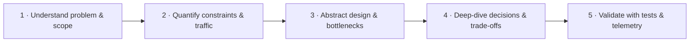

---

## 2. Problem and Scope

The design first establishes **the problem being solved, the explicit requirements, and the engineering assumptions that shape the solution**. Because the assessment leaves some production details open, reasonable assumptions are stated explicitly and tied to architectural decisions.

### 2.1 Core problem

A dealership user enters a VIN and expects a **single view of vehicle-related document metadata** even though the data is owned by two different external systems:

- Sales System API;
- Service System API.

The backend must query those systems **in parallel** and the UI must present one consolidated list with the source of every document clearly identified.

The core engineering problem is therefore not large-scale document processing. At the assumed ~120 metadata records per search, the harder problem is **dependable aggregation across two independent, differently behaving external dependencies**.

### 2.2 Use Case Diagram

The primary actor is a **dealership user** searching for vehicle documents. Sales and Service are secondary systems that supply document metadata. The diagram separates the assessment-required behavior from production-oriented behaviors added to make the design resilient and operable.

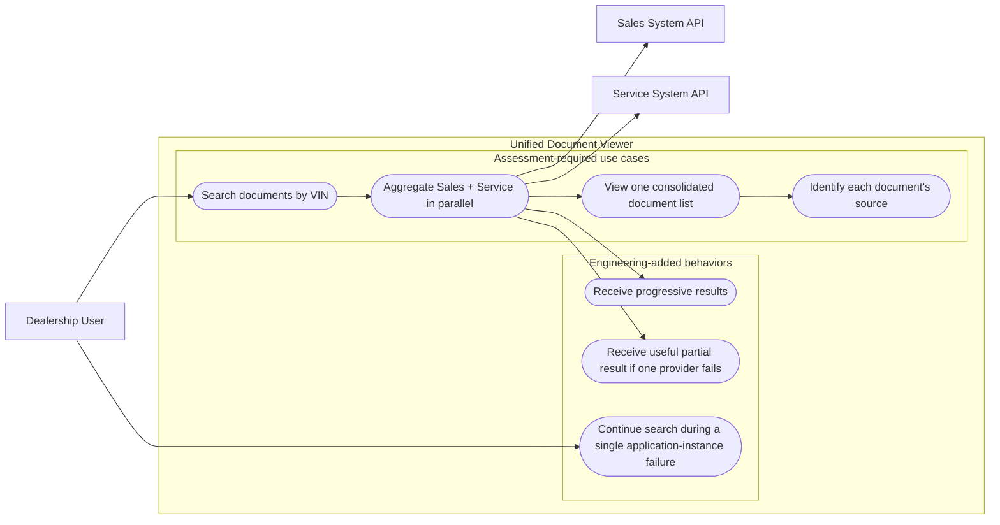

**Scope interpretation:** VIN search, parallel provider aggregation, consolidated display, and source identification are the Scenario D business requirements. The Unified Search Service itself does not require or directly access a persistent database; Sales and Service remain authoritative for document data. The broader solution satisfies persistent-storage needs through a downstream Audit Service, which consumes audit events and persists them to PostgreSQL. That Audit Service and its database are outside the scope of Scenario D.

### 2.3 Additions proposed for a production-quality design

These behaviors are not all explicitly requested by the brief, but they address realistic failure and operational concerns around the required use case.

| Added capability | Why it adds value | Decision |
|---|---|---|
| Partial results | One external provider should not make the whole search useless | Add `COMPLETE` / `PARTIAL` / `FAILED` outcomes |
| Progressive UI delivery | Sales may finish much earlier than Service | Add SSE for the interactive path while keeping REST |
| High availability | A single backend process should not be a production single point of failure | Run multiple Kubernetes replicas |
| Tenant isolation | Shared caches must not leak one dealership's data to another | Use positive integer `DealershipId` in cache/lock identity |
| Layered caching | Repeated VIN searches should not repeatedly pay external latency | Bounded per-pod L1 + shared Redis L2 |
| Cross-pod stampede protection | Multiple replicas can miss the same Redis key simultaneously | Redis distributed lock with post-lock L2 double-check |
| Provider backpressure | Many different VINs can still overload a slow provider | Independent Sales/Service concurrency limits |
| Observability | Design claims should be provable during operation | Structured logs, metrics, distributed traces |

### 2.4 Availability assumption

High availability is treated as an explicit non-functional use case:

> **A healthy application instance or a single provider failure should not unnecessarily make VIN search unavailable.**

This does **not** mean every dependency must always succeed. Instead:

- application replicas remove the single-process failure point;
- provider failures degrade independently to `PARTIAL` where possible;
- Redis failure degrades performance but should not make document retrieval unavailable;
- audit-event publication failure should not discard an otherwise valid search result; it is observed independently;
- rolling deployment and voluntary disruption should retain serving capacity.

### 2.5 Domain and integration assumptions

A deliberately heavier commercial/service vehicle is used as the per-search sizing case:

- ~**30 Sales documents**;
- ~**90 Service documents**;
- ~**120 metadata records total**;
- Sales normal latency: ~**1–2 s**;
- Service normal latency: ~**3–5 s**, with a degraded case of **10–20 s**.

Sales and Service are independent systems and may differ in authentication, DTO shape, pagination contract, rate limits, error format, latency, and availability. Provider adapters isolate those differences from the aggregation layer.

A dealership is the authorization/tenant boundary for this assessment. `DealershipId` is a **positive integer**. Fine-grained user-specific visibility inside one dealership is intentionally outside the current scope.

---

## 3. Constraints and Capacity Estimation

The assessment does not provide production traffic numbers, provider rate limits, retention requirements, or latency SLAs, so the design uses explicit sizing assumptions. They are not presented as Keyloop production facts; their purpose is to make the architecture quantitatively reviewable and to identify which parameters should later be validated with real production telemetry.

The working assumptions used throughout this section are: **1,000 dealerships × ~10 active users**, ~6 VIN searches/hour/user during an 8-hour business day, 22 business days/month, ~120 document metadata records/search, Sales latency ~1–2 s, Service latency ~3–5 s normally, and a 3× burst factor for peak traffic.

### 3.1 Request estimation

Assume:

- 1,000 dealerships;
- 10 active users/dealership;
- 6 searches/hour/user;

This is a sizing assumption, not a claimed Keyloop production figure.

Busy-hour average:

```text
1,000 × 10 × 6
---------------- ≈ 16.7 searches/second
      3,600
```

Use a **3× burst factor** for a practical design point:

```text
Peak design point ≈ 50 unified searches/second
```

The purpose of the estimate is not to predict exact traffic. It is to verify that the architecture has sensible capacity boundaries and to identify which numbers need measurement in production.

### 3.2 Read/write characteristics and the 80/20 heuristic

The business operation is fundamentally **read-oriented**: retrieve existing document metadata from Sales and Service. The Unified Search Service does not persist provider documents or search records. It may publish a compact audit event to EventHub, while durable storage is owned by the downstream Audit Service outside this service boundary.

A conventional “80% reads / 20% writes” rule should **not be applied mechanically** here. A single VIN search generates provider/cache reads and, optionally, one small asynchronous audit event. The dominant workload remains read/fan-out traffic.

The more useful 80/20 assumption is **hot-key locality**: a minority of recently active VINs/dealerships are likely to account for a large share of repeated searches. That is the workload characteristic that makes a short-lived L1/L2 cache valuable. The actual distribution must be validated with telemetry rather than hard-coded into the design.

### 3.3 External request fan-out

Provider pagination is treated as an external contract concern, not a reason to paginate the unified API.

Using the mock sizing model:

- Sales: ~1 provider request/page for ~30 documents;
- Service: ~2 requests/pages for ~90 documents if the provider caps a page around 50.

At 50 unified searches/s and no cache hits:

```text
50 searches/s × ~3 provider HTTP requests/search
≈ 150 external HTTP requests/s
```

At an illustrative 60% provider-cache hit rate:

```text
150 × 40% ≈ 60 external requests/s
```

The 60% hit rate is not a target or SLA. The real value should be measured in Grafana and used to decide whether the cache complexity is paying for itself.

### 3.4 Concurrent request pressure

At 50 search RPS and ~5 s p95 completion time:

```text
50 requests/s × 5 s ≈ 250 concurrent searches
```

If Service degrades toward ~10 s at the same arrival rate:

```text
50 × 10 s ≈ 500 concurrent searches / short-lived SSE streams
```

This is why the backend is designed around async I/O, cancellation, bounded queues/timeouts, connection pooling, provider bulkheads, and horizontal scaling rather than allocating a thread per external wait.

### 3.5 Data read per second

Assume each normalized metadata record is roughly **0.5–1 KB** as a sizing range after IDs, title/type/date/source and serialization overhead.

```text
120 docs/search × 0.5–1 KB
≈ 60–120 KB metadata/search
```

At a 50 RPS burst:

```text
≈ 3–6 MB/s of document metadata
```

That is not a high-throughput data-processing workload. It reinforces the main conclusion: **external latency, availability and fan-out are more important constraints than raw bandwidth or CPU.**

### 3.6 Audit event throughput

The Unified Search Service has no direct persistent-database write path. If audit publication is enabled, each completed search emits one compact EventHub event containing search/outcome metadata rather than document payloads.

Assuming an audit event is roughly **1–2 KB**, a 50 searches/s burst produces approximately:

```text
EventHub: 50 × 1–2 KB ≈ 50–100 KB/s ingress
```

This asynchronous side channel is not the primary scaling constraint. Durable audit storage, retention, and reporting are responsibilities of the downstream Audit Service and its PostgreSQL database, which are outside Scenario D.

### 3.7 Latency budget and initial service targets

The assessment does not define production SLAs. The following are engineering targets used to make the design measurable, not contractual Keyloop requirements.

| Signal | Initial design target | Why it matters |
|---|---|---|
| Unified API infrastructure availability | ~**99.9%** | The aggregation layer should not become the weakest dependency |
| Time to First Useful Result (TTFR) | ~**≤2 s p95** when Sales is healthy | Measures the user benefit of parallel calls + SSE |
| Complete search latency | ~**≤5–6 s p95** in normal provider conditions | Aligns with assumed Sales/Service latency |
| Overall interactive search budget | ~**12 s** | Prevents retries/degraded providers from holding users indefinitely |
| Partial-result rate | Measure/alert on trend | Signals dependency degradation |
| Provider timeout/error rate | Measure per provider | Separates application health from external-system health |

Retries are subordinate to the user-facing latency budget. A “10-second timeout × 3 retries” implementation that can hold a request for 30+ seconds would violate the design intent even if the retry count looked resilient in isolation.

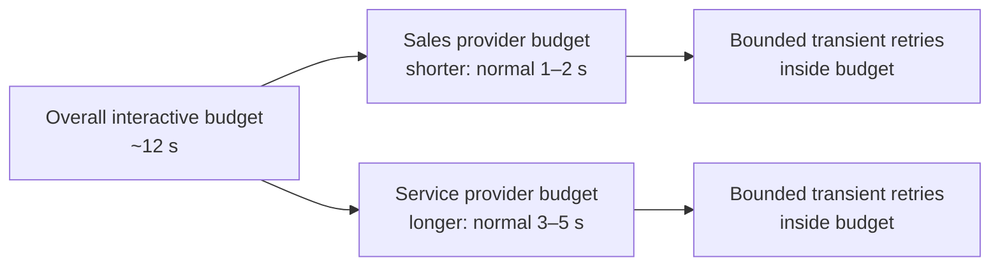

---

## 4. Abstract Design

Once scope and constraints are understood, the design is decomposed into **service, data, cache, integration and infrastructure layers**. The goal at this stage is to show the request path and identify bottlenecks before discussing implementation details.

### 4.1 Layered architecture

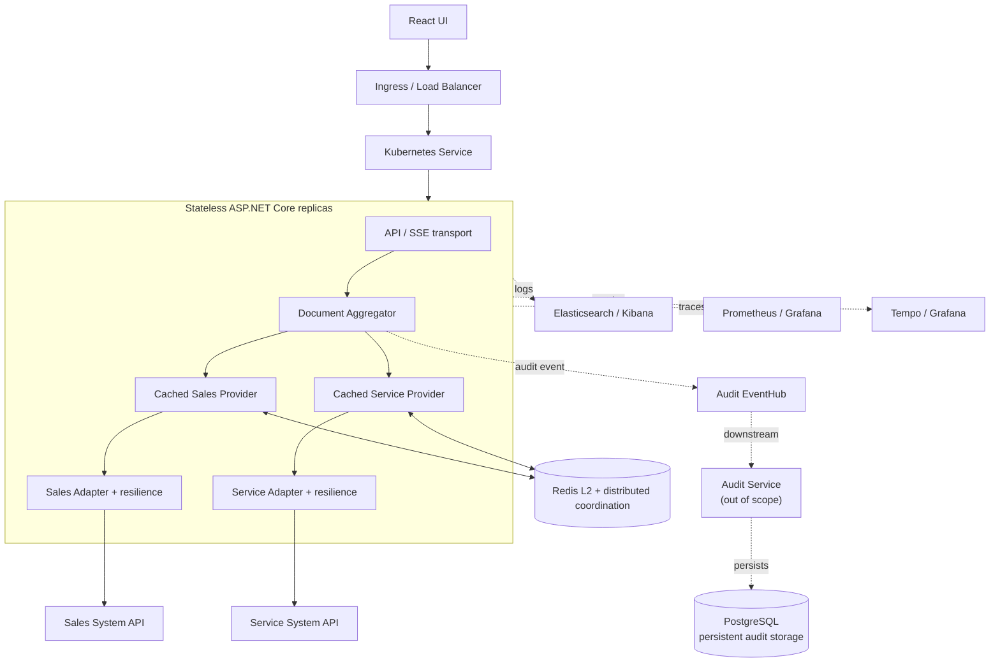

### 4.2 Layer responsibilities

| Layer/component | Responsibility |
|---|---|
| **Edge / Kubernetes Service** | Load-balance traffic across healthy backend replicas |
| **API / SSE transport** | Validate request, resolve dealership context, expose REST/SSE, propagate cancellation |
| **Document Aggregator** | Start Sales and Service concurrently, merge normalized outcomes, sort, produce `COMPLETE` / `PARTIAL` / `FAILED` |
| **Cached Provider Decorator** | Bounded L1, shared Redis L2, local single-flight, cross-pod stampede protection |
| **Provider Adapter** | Hide auth/schema/pagination differences and apply provider-specific timeout/retry/backpressure |
| **Redis** | Shared cache and distributed coordination across stateless replicas |
| **Audit EventHub** | Publish search/audit events to a downstream audit capability without putting audit processing in the search service |
| **Audit Service + PostgreSQL (out of scope)** | Consume audit events and own durable persistence outside the Unified Search Service boundary |
| **Observability stack** | Prove latency, failure, cache and concurrency behavior |

### 4.3 Key request algorithm

The core algorithm is intentionally simple at the aggregation layer:

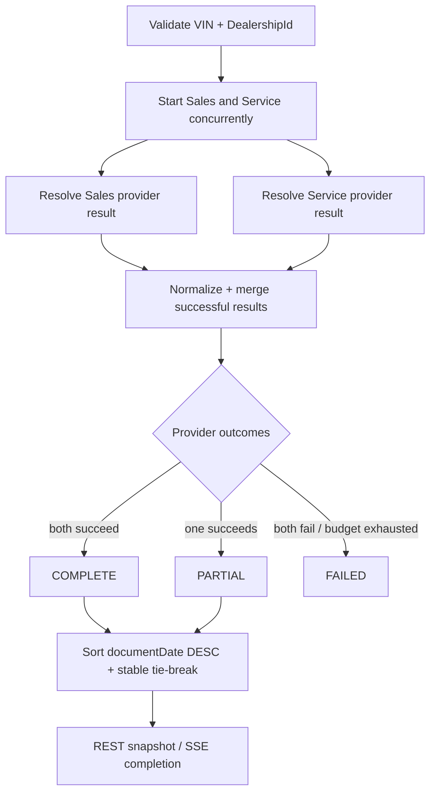

Each provider independently resolves through the protection path:

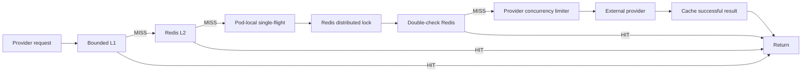

This keeps caching, coordination and resilience **outside the aggregator**, so the business orchestration remains testable without knowing where a provider result came from.

### 4.4 Infrastructure decisions at the abstract level

**Load balancing:** Kubernetes Service/Ingress distributes traffic across stateless backend replicas. No sticky session is required because search state is request-scoped and shared cache state lives in Redis.

**Messaging:** no broker is used in the synchronous document-retrieval path; the user is waiting for an interactive result, so async HTTP fan-out remains the correct model. EventHub is used only as an **asynchronous audit side channel** after/around search completion. Downstream audit consumption, storage, retention, and reporting are outside this service boundary.

**Persistence:** the Unified Search Service has no direct persistent-database dependency. Persistent storage exists in the broader solution through the downstream Audit Service, which consumes audit events and persists them to PostgreSQL. That service and database are outside Scenario D; Sales and Service remain authoritative for document data.

**Caching:** L1 handles the hottest local keys cheaply; Redis shares results across replicas. Both are optimizations and may be bypassed if Redis is unavailable.

### 4.5 Bottleneck review before implementation

| Potential bottleneck/failure | Why it appears | Design response |
|---|---|---|
| Slow Service dependency | Service can take 3–5 s normally and much longer when degraded | Parallel fan-out, SSE TTFR, bounded timeout, partial result |
| Same hot VIN requested repeatedly | Repeated provider latency/load | L1 + Redis cache |
| Same Redis key expires across many pods | Every replica could call the same provider | Local single-flight + provider-scoped distributed lock + double-check L2 |
| Many **different** VINs arrive together | Cache-key locks do not reduce distinct-key concurrency | Independent Sales/Service concurrency limiters |
| Redis outage | Lose L2 and distributed coordination at once | Fail open to provider path; limiter remains final provider protection |
| Backend pod failure/deployment | Single instance would interrupt service | Multiple stateless pods + Service + PDB + rolling update |
| Unbounded in-process cache | Competes with .NET heap and pod memory limit | Dedicated size-bounded L1 |
| Provider schema/auth changes | External contracts evolve independently | Provider adapters |
| Operational diagnosis | Distributed failure is hard to reason about from logs alone | Correlated Kibana logs + Grafana metrics + Tempo traces |

### 4.6 Design rationale

Each major component is tied to a constraint identified above:

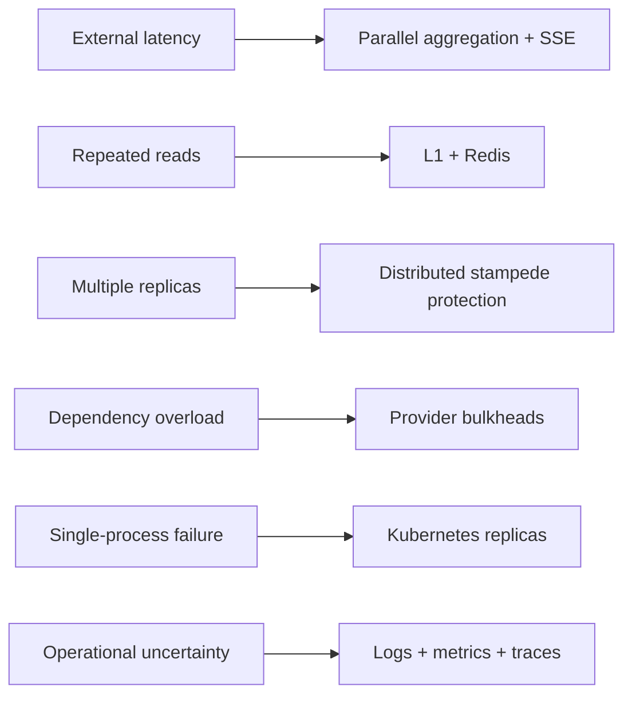

If measured traffic, cache locality, or provider limits do not justify a component, that component can be simplified or removed. The architecture is driven by dependency behavior and availability requirements, not by the ~120-record result size.

---

## 5. Request and Data Flow

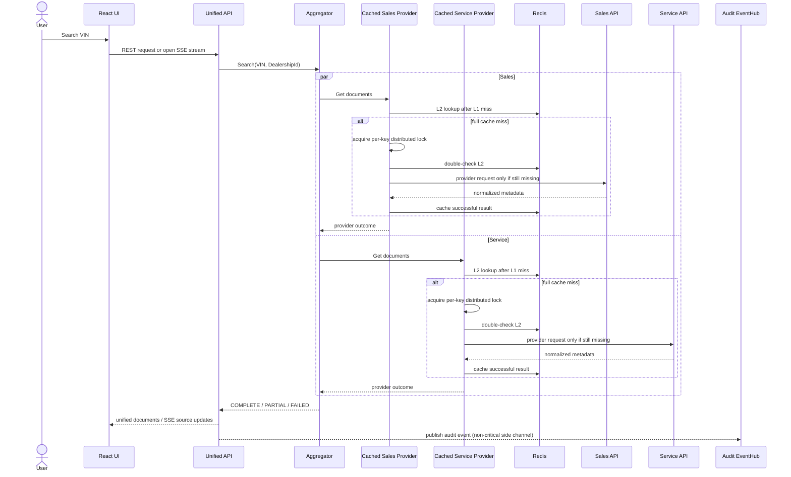

Key behaviors:

1. Sales and Service start **in parallel**.
2. Each provider independently resolves `L1 → Redis → provider`.
3. A successful source may be emitted over SSE before the slower source finishes.
4. One source failure does not discard the other source's successful documents.
5. Client cancellation propagates through the aggregator to cache waits and outbound HTTP calls.
6. The service publishes a compact audit event to EventHub; downstream audit processing is outside Scenario D and does not define the document-search response.

---

## 6. Key Design Decisions and Trade-offs

### 6.1 Parallel Aggregation

| Option | Advantages | Disadvantages | Decision |
|---|---|---|---|
| Sequential | Simpler control flow | Latency roughly adds: Sales + Service | Rejected |
| **Parallel** | Total latency approaches slowest provider instead of sum | Must handle independent outcomes | **Chosen** |

With assumed normal latency, sequential execution could be ~4–7 s; parallel execution is closer to ~3–5 s.

### 6.2 API Delivery: REST and SSE

This is **not a replacement of REST**. The system exposes both:

- **REST** — a simple final snapshot for tests, integrations, OpenAPI, and clients that want one completed response.
- **SSE** — the preferred interactive path for the React UI because the two providers can finish at very different times.

Assume Sales returns in 1 second while Service takes 10 seconds:

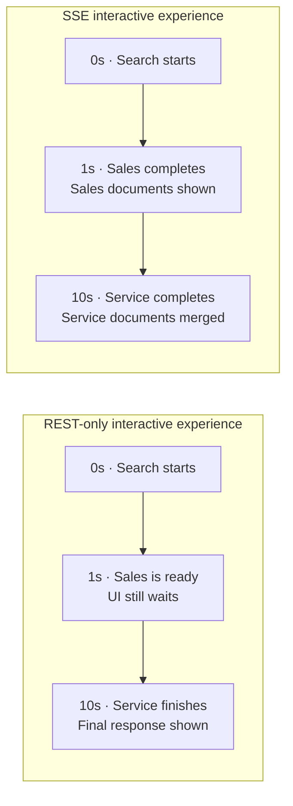

The important metric is **Time to First Useful Result (TTFR)**. SSE does not make Service faster; it prevents the fast provider from being hidden behind the slow provider.

| Option | Strength | Weakness | Decision |
|---|---|---|---|
| REST only | Simplest client/server model | User waits for the slowest provider before seeing anything | Keep for snapshot/integration use |
| WebSocket | Full duplex | More protocol/state complexity than this one-way update flow requires | Rejected |
| **SSE** | Simple server-to-client streaming over HTTP; natural fit for source-completed events | Long-lived connections and extra UI state | **Chosen for interactive search** |

SSE events are coarse-grained (`source.completed`, `source.failed`) rather than one event per document. This keeps the protocol easy to reason about and avoids unnecessary event volume.

#### Operational considerations

SSE introduces a few infrastructure requirements:

- disable proxy buffering for the SSE route and flush source-completion events promptly;
- configure ingress idle timeouts beyond the search budget;
- propagate client disconnect cancellation to cache waits and outbound HTTP;
- allow graceful pod termination for in-flight streams;
- keep the stream short-lived; disconnected clients may retry the search rather than resume it.

### 6.3 Caching Strategy

Caching exists primarily to **protect slow external systems and reduce repeated latency**. The external Sales and Service systems remain the systems of record.

Caching options considered:

| Option | Benefit | Limitation |
|---|---|---|
| No cache | Maximum freshness, simplest design | Every repeated VIN search pays provider latency and provider load |
| Redis only | Shared across all Kubernetes pods | Every hit still requires network I/O + serialization |
| **Bounded L1 + Redis L2** | Very fast hot path plus cluster-wide reuse | Slightly more cache policy complexity |

**Decision: use two levels.**

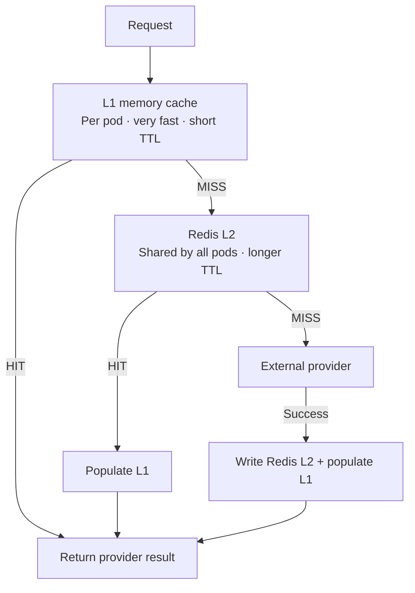

Redis provides **cluster-wide cache reuse** across Kubernetes replicas, while L1 avoids a network round trip for the hottest keys. L1 is explicitly size-bounded because each pod has a finite memory limit and the cache must not compete without limit with the .NET heap, request buffers, telemetry, and SSE state.

Initial cache policy is configurable rather than treated as a business SLA:

- L1 uses a short TTL and a bounded memory budget well below the pod limit;
- Redis uses a longer TTL to share provider results across replicas;
- only successful provider responses, including valid empty `200` results, are cached;
- provider timeouts and failures are never cached as empty data.

### 6.4 Cache Stampede Protection

Redis solves shared caching, but it does **not by itself prevent a cache stampede**.

If the same Redis key expires while several pods receive the same request:

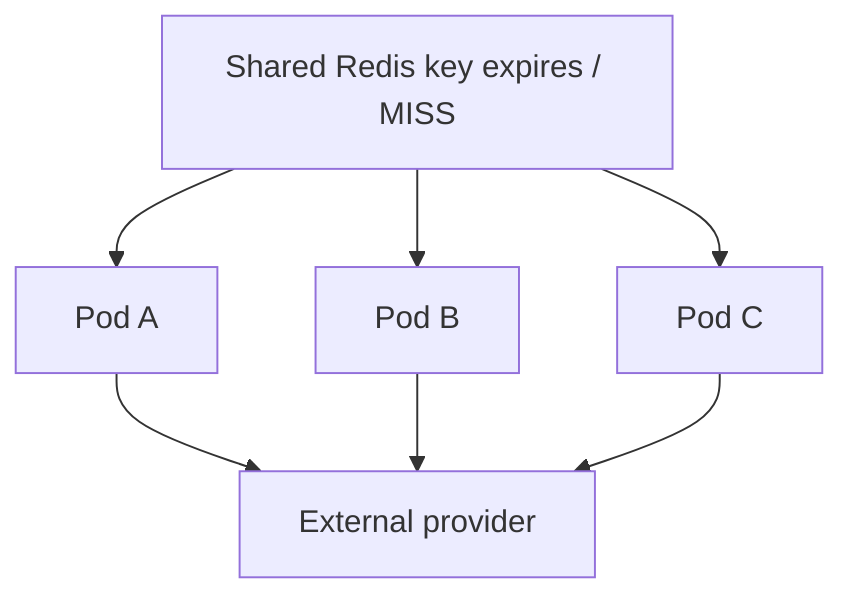

At 3 pods this is wasteful; at 10 pods it can multiply pressure on a degraded legacy API exactly when that API is least able to absorb it.

The chosen protection hierarchy is:

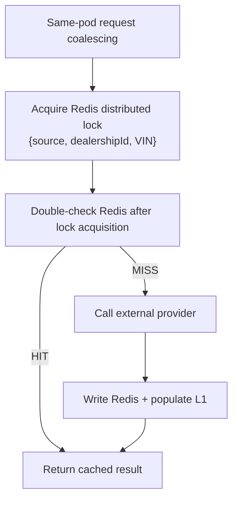

The second Redis check is essential: another pod may have populated the cache while this pod was waiting for the lock.

Keys are scoped independently:

```text
documents:{source}:{dealershipId}:{vin}
lock:documents:{source}:{dealershipId}:{vin}
```

This preserves two important properties:

- Sales and Service can still execute in parallel because they use different lock keys.
- Different dealerships do not share cache entries or lock coordination state.

The lock has a finite lease, ownership-safe release, bounded wait, cancellation support, and an availability fallback. If Redis is unavailable, the request can still call the provider directly rather than failing solely because the optimization layer is down.

### 6.5 Tenant-Aware Cache Isolation

VIN alone is an unsafe cache key in a multi-dealership system.

```text
BAD:  documents:SERVICE:{vin}
GOOD: documents:SERVICE:{dealershipId}:{vin}
```

This ensures cached documents for Dealership 42 cannot be reused for Dealership 99.

### 6.6 Provider Backpressure

Distributed locking protects **duplicate requests for the same cache key**, but it does not protect a provider from many different VINs arriving simultaneously.

For example, 500 distinct Service VIN searches have 500 distinct cache/lock keys and can still overload a slow legacy Service API. Therefore each provider has an **independent bounded concurrency policy**.

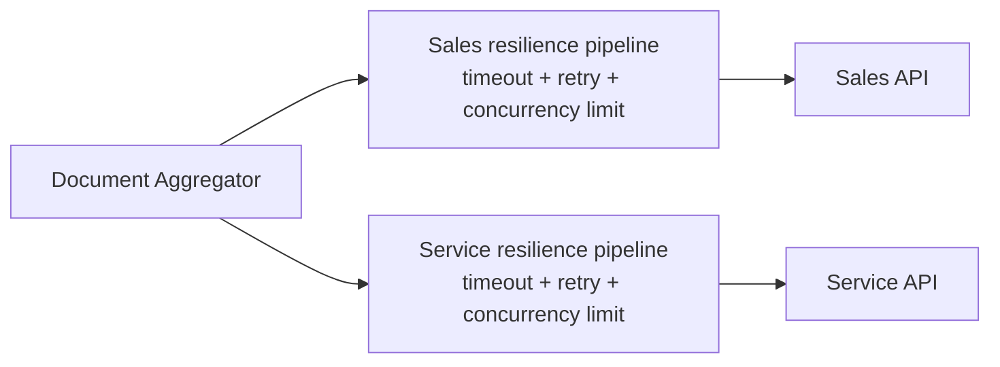

The design uses separate limits because Sales and Service may have different SLAs, rate limits, and capacity. A saturated Service provider must not consume all outbound capacity needed by Sales.

The limiter is deliberately **bounded**:

- only a configured number of provider requests may execute concurrently;
- any queue is bounded rather than unbounded;
- cancellation applies while waiting;
- when the bounded wait/queue is exhausted, the provider outcome is normalized as an overload/unavailable condition;
- if the other provider succeeds, the user still receives a `PARTIAL` result.

No universal concurrency number is claimed in the design. Initial values are configuration and should be tuned using provider rate limits, load tests, `provider_request_duration`, limiter rejection/wait metrics, and production telemetry.

The v1 concurrency limiter is **per pod**, which protects each application replica from unbounded work. With 3–10 replicas, aggregate provider concurrency can still be higher than one pod's limit. If a real provider exposes a strict cluster-wide quota, the next evolution would be a shared/API-gateway or distributed rate limiter. That added coordination is intentionally deferred until a real provider contract requires it.

This layer is particularly important during a Redis outage: losing Redis simultaneously removes L2 cache reuse and cross-pod distributed locking, which can sharply increase provider traffic. Provider concurrency limits remain the final local protection against cascading load.

### 6.7 Pagination Strategy

~120 metadata records is moderate.

A unified server-side cursor across two independently paginated providers requires global ordering, continuation state, and complex failure semantics. That complexity is not justified at the assumed volume.

**Decision:** provider adapters fully consume their own pagination; Unified API v1 returns the normalized collection.

### 6.8 Data Ownership and Persistence

| Option | Advantages | Disadvantages |
|---|---|---|
| Copy documents locally | Fast reads | Synchronization, stale copies, larger ownership/compliance surface |
| **Aggregate on demand** | Source systems remain authoritative | Depends on external latency/availability |

**Decision:** aggregate document metadata on demand and keep the Unified Search Service free of a direct persistent-database dependency. The service may publish audit events to EventHub; the downstream Audit Service owns durable PostgreSQL persistence and is outside Scenario D. Provider documents are never replicated locally.

---

## 7. Reliability and Failure Semantics

Each provider is an independent failure domain.

| Situation | User-visible behavior |
|---|---|
| Sales success + Service success | `COMPLETE` |
| Sales success + Service timeout/failure | `PARTIAL`, return Sales documents |
| Service success + Sales timeout/failure | `PARTIAL`, return Service documents |
| Both fail | `FAILED`, appropriate `502` / `504` Problem Details |
| Redis unavailable | Bypass cache/lock and call providers |
| Audit EventHub publish failure | Record telemetry and preserve the user search result; downstream audit handling is outside this service |
| Client disconnect | Cancel pending work where practical |

Provider retry/backpressure policy:

- Retry only transient network/`502`/`503`/`504`, and optionally `429` respecting `Retry-After`.
- Do not blindly retry `400`/`401`/`403`/`404`.
- All retries fit inside a bounded provider/request time budget.
- Sales and Service use independent concurrency limiters/bulkheads.
- Concurrency wait queues are bounded; the service does not create an unlimited in-memory backlog while a provider is degraded.
- Provider overload/limiter rejection is normalized as a provider failure and participates in normal `PARTIAL` semantics.

`200 OK` with an empty collection is a valid cacheable result. Timeouts/errors are never cached as empty data.

### Cascading-failure protection

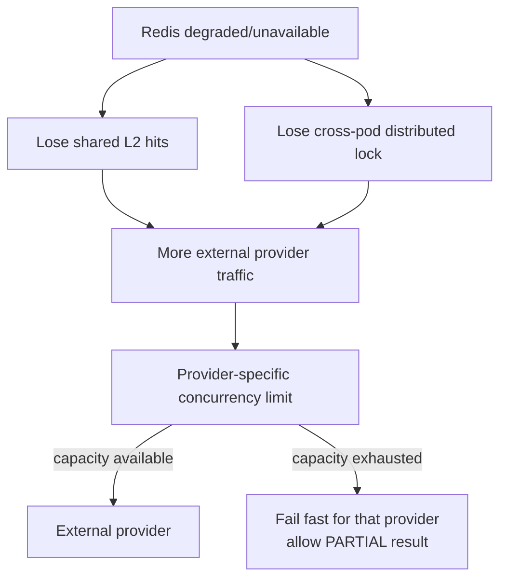

The goal is not to guarantee that dependencies never fail. The goal is to prevent one degraded dependency from consuming unbounded application resources or causing a cascading outage.

---

## 8. Deployment and Scalability

Kubernetes is used because the design target is a **production-style, horizontally scalable service**, not because ~120 document records require distributed compute.

The primary reasons are availability and operational safety:

1. **No single application instance** — one pod can restart or fail without taking down VIN search.
2. **Rolling deployments** — new versions can be released while healthy replicas continue serving traffic.
3. **Horizontal scaling** — the service is I/O-heavy and can add replicas when concurrent searches/SSE connections increase.
4. **Resource isolation** — each pod has explicit CPU/memory requests and limits, which is especially important because every pod owns an L1 cache.
5. **Graceful disruption** — PDB and rolling-update settings keep enough replicas available during maintenance/deployments.

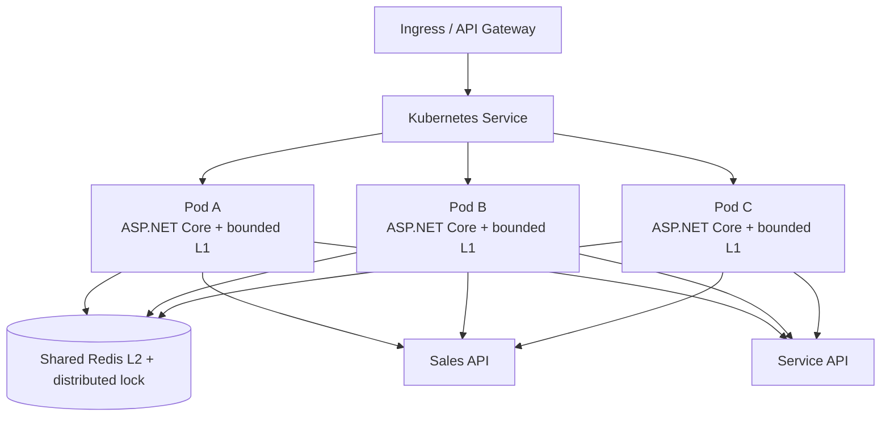

### Baseline deployment policy

| Item | Starting decision | Reason |
|---|---|---|
| Replicas | **3** | Baseline redundancy across pod/node disruptions |
| HPA | **3–10** | Allows burst/concurrency growth without permanently paying for peak capacity |
| PDB | `minAvailable: 2` | Preserve availability during voluntary disruptions |
| Rolling update | `maxUnavailable: 0`, `maxSurge: 1` | Avoid dropping capacity during deployment |
| CPU | request ~250m, limit ~1 CPU | Initial assumption to tune from metrics |
| Memory | request ~256Mi, limit ~512Mi | Gives a clear per-pod memory envelope |
| L1 cache | bounded well below 512Mi | Cache must not dominate process memory |

`/health/live` checks only process health. `/health/ready` does **not** call Sales or Service, because external provider failure is an application-level condition handled through `PARTIAL` results, not a reason to remove a healthy pod from service.

CPU-based HPA is a pragmatic starting signal. Because the workload is I/O-heavy, a mature production deployment could additionally scale on request rate, latency, active SSE connections, or provider concurrency.

### Cache implications of horizontal scaling

Multiple replicas directly create two cache concerns:

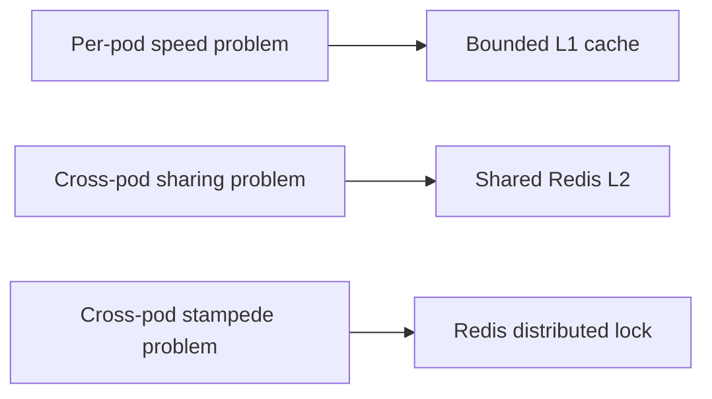

This is why caching, Kubernetes, and distributed coordination are treated as one connected design decision rather than independent technologies.

---

## 9. Observability

Observability validates architectural behavior and supports production diagnosis. Runtime evidence from the implemented service is included where indicated.

The observability model is:

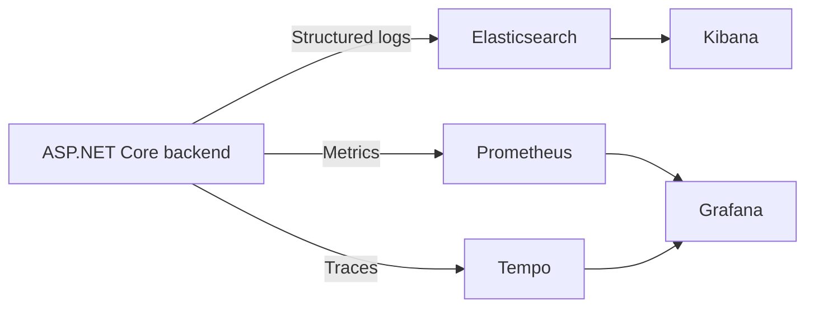

### 9.1 Kibana — Logs

Readable fields:

```text
@timestamp
log.level
event.name
message
provider
duration_ms
search.status
trace.id
```

Important events include `DocumentSearchStarted`, `ProviderRequestCompleted`, `ProviderRequestFailed`, `CacheHit`, `CacheMiss`, `DistributedLockContention`, and `DocumentSearchCompleted`.

Severity semantics:

- `Information` — normal lifecycle.
- `Warning` — handled degradation, such as Service timing out while Sales still produces a `PARTIAL` result.
- `Error` — unexpected internal failure.

#### Runtime evidence placeholder

> 📸 **Insert a real Kibana Discover screenshot before submission.**  
> Suggested columns: `@timestamp | log.level | event.name | provider | duration_ms | search.status | trace.id`

<!-- Example final path:

-->

The evidence should show one correlated search lifecycle, including provider completion/failure and the final search outcome.

### 9.2 Grafana — Metrics

The Grafana dashboard should make the most important design decisions measurable:

- request rate;
- p50/p95/p99 search latency;
- `COMPLETE` vs `PARTIAL` rate;
- Sales vs Service latency/error rate;
- L1 hit/miss ratio;
- Redis L2 hit/miss ratio;
- distributed-lock contention/fallback;
- provider concurrency / limiter wait / rejection rate;
- provider request reduction due to cache;
- active SSE connections;
- TTFR and overall search latency against the initial engineering targets.

No VIN or `DealershipId` is used as a Prometheus label because that would create high-cardinality metrics.

#### Runtime evidence placeholder

> 📸 **Insert a real Grafana dashboard screenshot before submission.**  
> Recommended panels: `Request rate | TTFR/p95 latency | Partial rate | Sales/Service latency | L1/L2 cache hit rate | Lock contention | Provider limiter rejection`

<!-- Example final path:

-->

The evidence should make latency, provider health, cache effectiveness, and contention visible in one operational view.

### 9.3 Tempo — Distributed Tracing

A trace should visibly show overlapping provider spans:

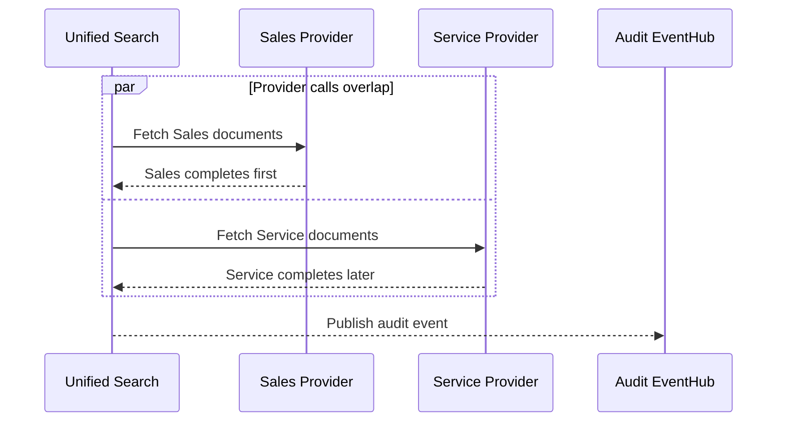

Overlapping Sales and Service spans provide runtime proof that the required provider calls execute concurrently and identify which dependency dominates latency.

#### Runtime evidence placeholder

<!-- Replace with real screenshot if captured:

-->

> 📸 **Insert a real Tempo trace screenshot here before submission if available.**

The same `trace.id` should be searchable in Kibana and Tempo.

---

## 10. Technology Choices

| Technology | Why it fits this problem |
|---|---|
| **ASP.NET Core 10 / C#** | Strong async I/O, cancellation, DI, HTTP client/resilience integration, SSE, and observability support. |
| **React + TypeScript** | Clear state model for progressive source updates and unified table UX. |
| **IHttpClientFactory + .NET resilience stack** | Provider-specific pooling, timeout/retry/circuit-breaker configuration. |
| **Provider concurrency limiter / bulkhead** | Bounds outbound concurrency independently for Sales and Service to prevent dependency overload and cascading failure. |
| **Dedicated MemoryCache** | Very low-latency L1 with explicit size budget. |
| **Redis** | Shared L2 cache and cross-pod coordination. |
| **Azure Event Hubs** | Asynchronous audit-event handoff; keeps downstream audit processing outside the Unified Search Service. |
| **PostgreSQL (Audit Service, out of scope)** | Durable audit persistence owned by the downstream Audit Service, not by Unified Search. |
| **Kubernetes** | Horizontal scaling, rolling updates, probes, disruption control. |
| **OpenTelemetry** | Common correlation model across logs, metrics, and traces. |
| **Elasticsearch + Kibana** | Searchable structured logs across replicas. |
| **Prometheus + Grafana** | Operational metrics and cache/provider performance dashboards. |
| **Tempo** | Distributed trace storage and visualization. |
| **xUnit** | Core behavior, failure, cache, concurrency, and API tests. |

---

## 11. Cost and Resource Awareness

Exact cloud cost is intentionally not quoted because provider, region, managed-service tier, retention, and traffic are unspecified. Instead, the design identifies the main cost drivers and scaling levers.

### Backend baseline resource envelope

At 3 pods:

```text
CPU requested:    3 × 250m   = 0.75 vCPU
Memory requested: 3 × 256Mi  = 768Mi
CPU hard limits:  3 × 1 CPU  = 3 vCPU
Memory limits:    3 × 512Mi  = 1.5Gi
```

### Main variable-cost drivers

1. **External API traffic** — reduced by L1/L2 cache and stampede protection.
2. **Redis memory** — driven by unique `{dealership, VIN, provider}` keys within TTL, not total historical vehicles.
3. **Observability retention** — logs/traces often cost more than metrics; retention and sampling should be tuned deliberately.
4. **Pod count** — HPA scales application cost with load.
5. **Audit EventHub** — small event ingress compared with provider/document traffic. Durable audit-storage cost, including PostgreSQL, belongs to the downstream Audit Service and is outside the Unified Search Service boundary.

The Unified Search Service intentionally avoids local durable storage of provider documents or search records. Persistent audit storage exists only in the downstream Audit Service, outside this service boundary.

---

## 12. API and Data Contract Summary

### Unified REST

```http
GET /api/v1/vehicles/{vin}/documents
X-Dealership-Id: 42
```

Response contains:

```text
vin
status: COMPLETE | PARTIAL
documents[]
sources[]
totalCount
```

### Unified SSE

```http
GET /api/v1/vehicles/{vin}/documents/stream
X-Dealership-Id: 42
Accept: text/event-stream
```

Events:

```text
search.started
source.completed
source.failed
search.completed
```

### Canonical document

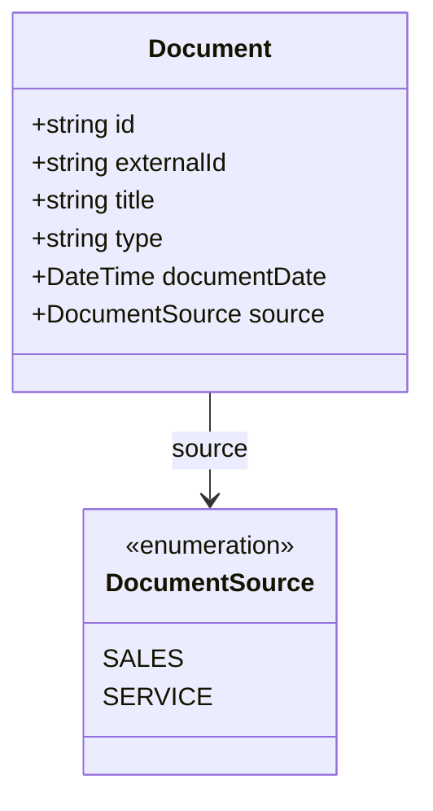

`id` is globally stable within the unified view and is formed as `SOURCE:externalId`; `documentDate` is normalized to UTC.

---

## 13. Validation Strategy

The most valuable tests are those that validate architectural claims:

| Claim | Proof |
|---|---|
| Sales and Service are parallel | Integration test + overlapping Tempo spans |
| One provider failure is survivable | `PARTIAL` API/SSE tests |
| Tenant data cannot cross cache boundaries | Same VIN, different `DealershipId` tests |
| Multi-pod cache miss does not stampede provider | Concurrent shared-Redis test verifies ~1 upstream call |
| Redis is not a hard availability dependency | Redis-down test still retrieves provider data |
| Provider overload is bounded | Concurrency test verifies limiter/queue rejection without unbounded growth |
| Retry policy respects latency budget | Timed integration test verifies retries cannot exceed configured provider/search budget |
| L1 cannot grow unbounded | Cache size-limit tests/config verification |
| Cancellation works | Disconnect/cancellation propagation tests |
| Observability is useful | Kibana fields, Grafana panels, Tempo traces validated against real requests |

---

## 14. Conclusion

The design keeps the Unified Document Viewer focused on its core responsibility: **aggregate Sales and Service document metadata reliably, return useful results despite independent dependency failures, and remain observable and safe to scale across replicas**. Complexity is introduced only where the stated assumptions and failure modes justify it, and each major architectural claim is backed by a validation method.
